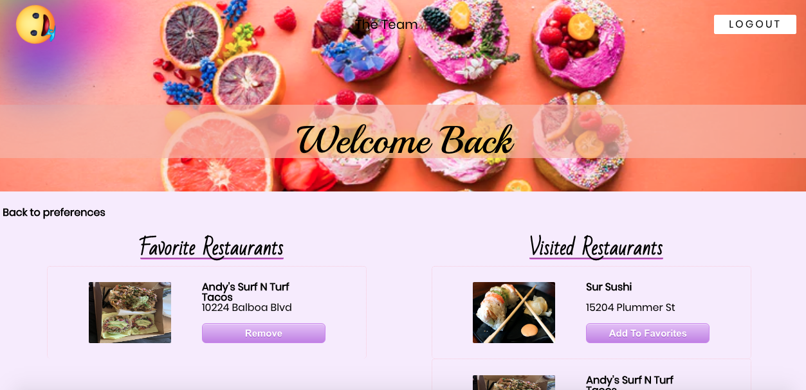
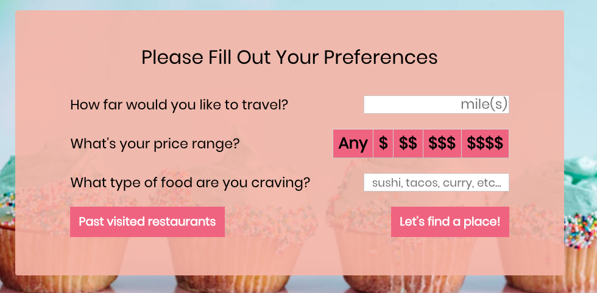
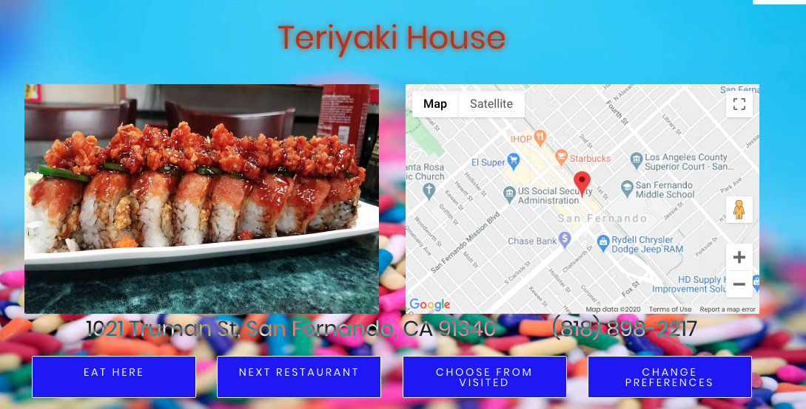

# WatchuWant
[View the live site](https://watchuwant.herokuapp.com/#/)

Hungry? Don't know what to eat? WatchuWant is a web application that will decide which restaurant to go to based on user 
current location and preferences.

### Backend
* Express.js
* MongoDB
### Frontend
* React
### Other
* Yelp API
* Google Maps API
* Node.js
* SCSS
* Heroku

# Features
* User Authentication
* Favorites
* Restaurant Picker
* Visited Restaurants History
* Restaurant Show Page

### User Authentication
Users can create an account and log in. User authentication for this web application was made using the BCrypt gem and SecureRandom module. 
***

### Favorites
Users can add past visited restaurants to their favorites. 

***

### Restaurant Picker
Users fill out and submit a preferences form. Yelp API is used to search for restaurants and Google Maps API is used to display
map information and get a user's current location. This web application will pick one restaurant at random and a user has an option to choose another.

***
